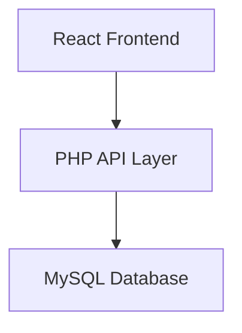

# 🖼️ React x PHP | Photo Gallery System

A full-stack **photo gallery management system** built with **React (frontend)** and **PHP (backend)**. This application allows users to perform all essential CRUD operations—uploading, viewing, editing, and deleting personal photos—with additional support for metadata, filtering, and search.

---

## 🌟 Features

| Functionality      | Description                                               |
| ------------------ | --------------------------------------------------------- |
| 📤 Upload Photos   | Users can upload images with title, description, and tags |
| 🖼️ Gallery View   | Grid layout for browsing all uploaded photos              |
| 🔍 Search & Filter | Filter by tags and search by title or description         |
| ✏️ Edit Details    | Users can update metadata or replace the image            |
| ❌ Delete Image     | Users can permanently remove an image from the system     |

---

## 🧱 Tech Stack

* **Frontend**: React, Tailwind CSS (optional)
* **Backend**: PHP (RESTful APIs)
* **Database**: MySQL
* **HTTP**: Axios (for frontend API communication)

---

## 🖼️ Component Diagram



---

## 📦 Backend API Overview

### POST `/upload`

Uploads a new photo and saves metadata.

* Params: image file, title, description, tags

### GET `/photos`

Returns all photo metadata and paths.

* Supports optional filters: `?tag=`, `?search=`

### PUT `/photo/:id`

Updates a photo’s title, description, or image.

### DELETE `/photo/:id`

Deletes a photo and its metadata from the database.

---

## 🧪 Local Development

### 1. Clone the Repository

```bash
git clone https://github.com/your-username/photo-gallery-app.git
cd photo-gallery-app
```

### 2. Set Up Backend (PHP + MySQL)

* Create a database and import `gallery.sql`
* Configure `config.php` with DB credentials

### 3. Start React Frontend

```bash
cd client
npm install
npm run dev
```

---

## 📝 Example Image Metadata

```json
{
  "title": "Sunset by the Beach",
  "description": "Captured during my summer trip",
  "tags": ["sunset", "beach", "vacation"]
}
```

---

## 📂 Folder Structure

```
photo-gallery-app/
├── client/                # React frontend
│   └── src/
│       └── components/
├── server/                # PHP backend
│   ├── api/
│   └── uploads/
├── database/
│   └── gallery.sql
```

---

## 📄 License

MIT License

---

## 👨‍💼 Author

Built by **Ghady Matta** — Full Stack Developer with a passion for visual storytelling through tech.
